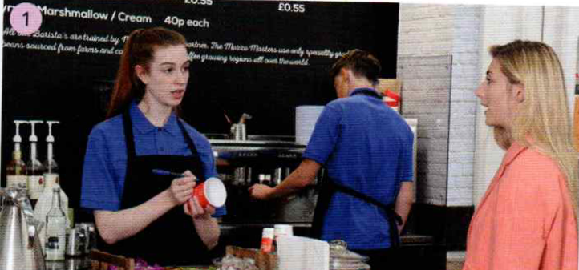
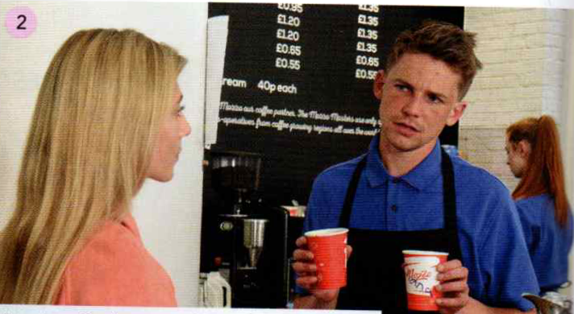
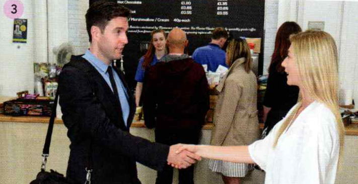
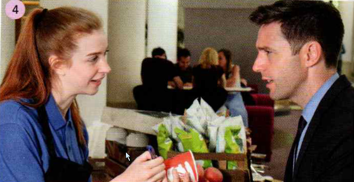
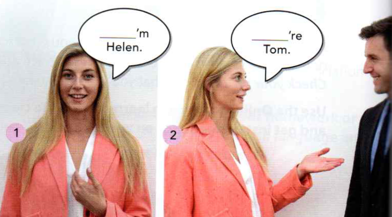
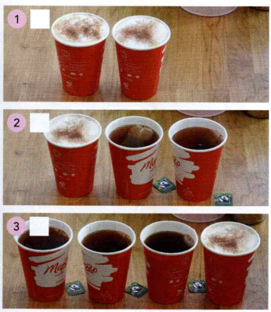
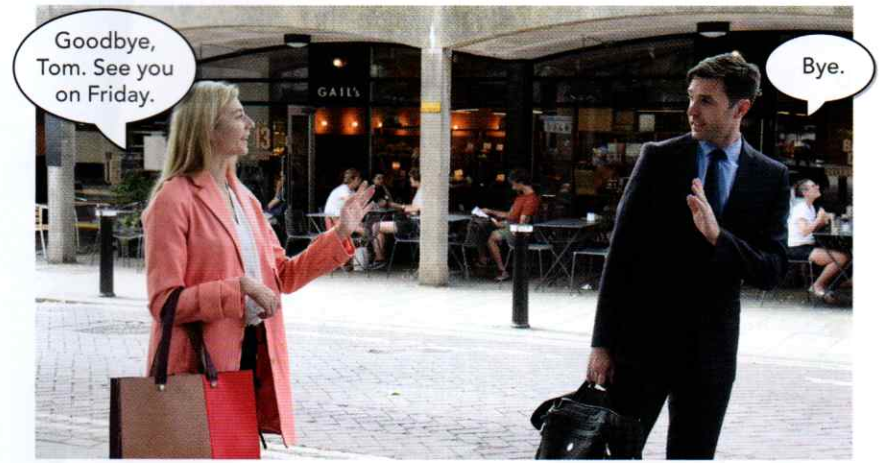

# 1A - A cappuccino, please

1.2 / 6
 

|  1  Helen - Barista  |  2    |
| ---- | ---- |
| H:  A cappuccino, please. | B:  Are you Diana? |
| B:      What's your name? | H:      No, I'm not.   I'm Helen. |
| H:  Helen. | B:  Sorry. |
| B:      Ellen? | B:  Helen?  Your cappuccino. |
| H:  No, Helen. | H:      Thanks. |
| B:      Helen. OK. | . |
| B:      One cappuccino | . |

<audio controls src="./1_1A__A_cappuccino_please.assets/EF1_4ed_SB__01_02.mp3"></audio>

**T**om  - **H**elen

|  3    |  4    |
| ---- | ---- |
| T:  Hello.   Are you Helen? | T:  Hi.  A tea, please. |
| H:      Yes, I am.   And you're Tom. | B:      OK.  What's your name? |
| T:  Yes!   Nice to meet you. | T:  Tom. |
|  H:     Nice to meet you. | B:      Dorn.  A tea. |
|  T:  Just a minute. | T:  No, I'm Tom, not Dorn. |

1.3 / 6

<audio controls src="./1_1A__A_cappuccino_please.assets/EF1_4ed_SB__01_03.mp3"></audio>

----

1.4 / 92 (G)    
Sloveso:       **be**              (oznamovací věta,   zápor [-] )
Zájmena:     **I ,  You** ?   (já, ty )

<audio controls src="./1_1A__A_cappuccino_please.assets/EF1_4ed_SB__01_04.mp3"></audio>

|      |      |      |       |
| ---- | ---- | ---- | ---- |
| **I am** Helen. |  **I'm** Helen.  | - | **Já jsem** Helena. |
| **You are** Tom. |   **You’re** Tom.  | - | **Ty jsi** Tom |
| **I am not** Ellen.  |     **I’m not** Ellen.  | - | **Já nejsem ... ** |
| **You are not** Dom.  |    **You aren’t** Dom.  | - |  **Ty nejsi  ... ** |

----
1.5 / 92   **be**  ... otázky [?]

<audio controls src="./1_1A__A_cappuccino_please.assets/EF1_4ed_SB__01_05.mp3"></audio>

|  [?] |  [+]   |  [-]    |
| ---- | ---- | ---- |
|  Am I in class 2?    | Yes, you are. |  No, you aren’t.    |
| Are you Mike?     |   Yes, I am.   |  No, I’m not.    |

in class = ve třídě (školní) 

----
1.6 / 6

<audio controls src="./1_1A__A_cappuccino_please.assets/EF1_4ed_SB__01_06.mp3"></audio>

|      |      |      |       |
| ---- | ---- | ---- | ---- |
|   I am   | I’m    |  -    |  Já jsem ...     |
|   you are   |  you’re    |  -     |  Ty jsi ...      |
|  I am not    |   I’m not   |  -    |   Já nejsem ...    |
|   you are not   |    you aren’t  |  -    |  Ty nejsi     |

----
1.7 / 7

<audio controls src="./1_1A__A_cappuccino_please.assets/EF1_4ed_SB__01_07.mp3"></audio>

|      |      |
| ---- | ---- |
| Maria     |   A cappuccino, please.   |
|  Andrew    |   A tea for me.   |
|  Sally    |    And a tea for me, too.   |
|      |      |
| Assistant     |  What’s your name?    |
| Maria     |  Maria.   |
|  Andrew    |  I’m Andrew.    |
| Sally     |  I’m Sally.    |
|      |      |
| Assistant     |  Two teas and one cappuccino.    |

----
1.8 /  116 V  **Numbers  0 - 10

<audio controls src="./1_1A__A_cappuccino_please.assets/EF1_4ed_SB__01_08.mp3"></audio>

|      |    |
| ---- | ---- |
|  0   | zero   |
|  1   |   one  |
|  2   | two     |
|  3   |   three   |
|  4   |  four   |
|  5   |  five    |
|  6   | six     |
|  7   |   seven   |
|  8   | eight     |
|  9   | nine |
|  10  |   ten   |

----
1.9 /  7  

<audio controls src="./1_1A__A_cappuccino_please.assets/EF1_4ed_SB__01_09.mp3"></audio>

    
Poslouchej a napiš čísla:

     &nbsp; &nbsp;
    7 &nbsp; &nbsp; 
    3 &nbsp; &nbsp; 
    0 &nbsp; &nbsp; 
    8 &nbsp; &nbsp; 
    9 &nbsp; &nbsp; 
    1 &nbsp; &nbsp; 
    4 &nbsp; &nbsp; 
    5 &nbsp; &nbsp; 
    6 &nbsp; &nbsp; 
    2 &nbsp; &nbsp; 
    10
    

----
1.10 /  7  

<audio controls src="./1_1A__A_cappuccino_please.assets/EF1_4ed_SB__01_10.mp3"></audio>

    
Poslouchej a řekni další číslo:

    1 &nbsp; &nbsp; 2 &nbsp; &nbsp; - &nbsp; &nbsp; 3  
    7 &nbsp; &nbsp; 8 &nbsp; &nbsp; - &nbsp; &nbsp; 9  
    3 &nbsp; &nbsp; 4 &nbsp; &nbsp; - &nbsp; &nbsp; 5  
    5 &nbsp; &nbsp; 6 &nbsp; &nbsp; - &nbsp; &nbsp; 7  
    4 &nbsp; &nbsp; 5 &nbsp; &nbsp; - &nbsp; &nbsp; 6  
    2 &nbsp; &nbsp; 3 &nbsp; &nbsp; - &nbsp; &nbsp; 4  
    6 &nbsp; &nbsp; 7 &nbsp; &nbsp; - &nbsp; &nbsp; 8  
    0 &nbsp; &nbsp; 1 &nbsp; &nbsp; - &nbsp; &nbsp; 2  
    8 &nbsp; &nbsp; 9 &nbsp; &nbsp; - &nbsp; &nbsp; 10  
    

----
1.11 / 7   **Výslovnost:**

<audio controls src="./1_1A__A_cappuccino_please.assets/EF1_4ed_SB__01_11.mp3"></audio>

house    **/h/**    hi    hello    Helen

bike    **/ai/**    I’m    nice    five    nine

tree    **/i:/**    meet    three    tea    please

----
1.12 / 7   **Poslouchej a nahlas opakuj:**

<audio controls src="./1_1A__A_cappuccino_please.assets/EF1_4ed_SB__01_12.mp3"></audio>

**H**ello, **H**elen! 

H**i**, **I**’m M**i**ke. 

Thr**ee** t**ea**s, pl**ea**se.

----
1.13 / 7   **Dny v týdnu:**

<audio controls src="./1_1A__A_cappuccino_please.assets/EF1_4ed_SB__01_13.mp3"></audio>

|      |      |      |
| ---- | ---- | ---- |
| Monday | - | pondělí |
| Tuesday | - | úterý |
| Wednesday | - | středa |
| Thursday | - | čtvrtek  |
| Friday | - | pátek |
| Saturday | - | sobota |
| Sunday | - |  neděle |

----
1.14 / 7   **Poslouchej a opakuj:**

<audio controls src="./1_1A__A_cappuccino_please.assets/EF1_4ed_SB__01_14.mp3"></audio>

Goodbye, Tom.         =    Nashledanou Tome
See you on Friday.   =    Uvidíme se v pátek.
Bye.                            =     Naschle

----
1.15 / 131

<audio controls src="./1_1A__A_cappuccino_please.assets/EF1_4ed_SB__01_15.mp3"></audio>

|      |      |      |
| ---- | ---- | ---- |
| Hello. | - | Zdravím. |  
| Hi.  | - | Ahoj |  
| What’s your name?  | - | Jaké je tvé jméno? |  
| Nice to meet you.  | - | Rád vás potkávám. |  
| A cappuccino, please.  | - | Kapučíno prosím. |  
| A tea.  | - | Jeden čaj. |  
| Yes.  | - | Ano |  
| No.  | - | Ne |  
| OK.  | - | Dobře |  
| Thanks.  | - | Díky |  
| Sorry.  | - | Promiňte |  
| Just a minute.  | - | Jen minutku. |  
| Goodbye. / Bye.  | - | Nashle |  
| See you on Friday.  | - | Uvidíme se v pátek. |  
| See you tomorrow. | - | Uvidíme se zítra. |  

----

|      |      |      |       |
| ---- | ---- | ---- | ---- |
|      |      |      |       |
|      |      |      |       |
|      |      |      |       |
|      |      |      |       |
