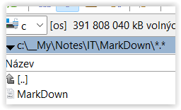

# 1) Images

Lokálně uložený obrázek v adresáři assets:

# 2) Audio

Default HTML kód při vložení audia vygenerovaný Typorou je:
`<audio src="./assets/01_01.mp3"></audio>`

<audio src="./assets/01_01.mp3"></audio>

Aby fungoval i ve vyexportovaném HTML, tak je potřeba doplnit `controls`:
`<audio controls src="./assets/01_01.mp3"></audio>`

<audio controls src="./assets/01_01.mp3"></audio>

# 3) Expandable content

Řádek 1

    
Rozbal 1

    Schovaný text 1
    

    
Rozbal 2

    Schovaný text 2
    

Řádek 2

# 4) Ostatní

==Zvýraznění==

